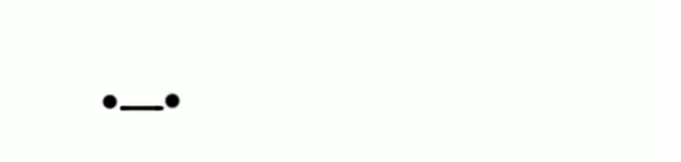

<h1> Opa,Bão? 👋</h1>

HI,my name is Raian i'm from Brasil 🇧🇷 (yes brasil with S, Because I am Brazilian 😎) tenho 18 anos de idade  sou um estudante de programação
e tenho muito interesse em vários ramos da tecnologia como:
*Robótica
*Eletrônica
*Machine learning
*AI
*Data Science   
*Blockchain e criptomoedas
*......(se eu for continuar vamos ter muuuuitos tópicos)

* Item 1
* Item 2
* Item 3

 

<!--
**RaianNolaco/RaianNolaco** is a ✨ _special_ ✨ repository because its `README.md` (this file) appears on your GitHub profile.

Here are some ideas to get you started:

- 🔭 I’m currently working on ...
- 🌱 I’m currently learning ...
- 👯 I’m looking to collaborate on ...
- 🤔 I’m looking for help with ...
- 💬 Ask me about ...
- 📫 How to reach me: ...
- 😄 Pronouns: ...
- ⚡ Fun fact: ...
-->
