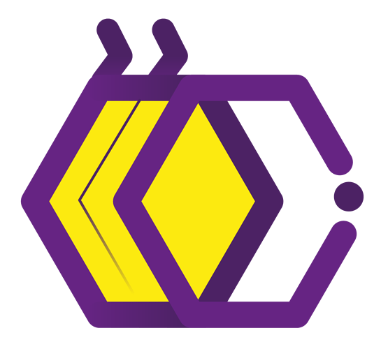

<h1> Opa,Bão? 👋</h1>

 
HI,my name is Raian i'm from Brasil 🇧🇷 (yes brasil with S, Because I am Brazilian 😎)  I am a student of programming
and I am very interested in various branches of technology like:
 

* AI
* Robotics
* Blockchain
* Electronics
* Data Science   
* Machine learning
* ......(if i continue we will have many, many topics)

 

 

 

 
 

 

 

<!--
**RaianNolaco/RaianNolaco** is a ✨ _special_ ✨ repository because its `README.md` (this file) appears on your GitHub profile.

Here are some ideas to get you started:

- 🔭 I’m currently working on ...
- 🌱 I’m currently learning ...
- 👯 I’m looking to collaborate on ...
- 🤔 I’m looking for help with ...
- 💬 Ask me about ...
- 📫 How to reach me: ...
- 😄 Pronouns: ...
- ⚡ Fun fact: ...
-->
